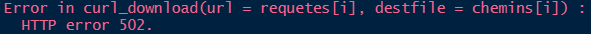

```{r setup, include = FALSE}
knitr::opts_chunk$set(
  collapse = TRUE,
  cache = FALSE,
  comment = "#>",
  fig.align = 'center'
)
```

# Pourquoi ce package ?

Le `package {hydrodataFR}` propose une palette d'outils pour faciliter l'exploitation des données de la [banque HYDRO](http://hydro.eaufrance.fr/).

# Installation

## Configuration R et RStudio

Se reporter à la description donnée au début du [tuto sur l'importation des données avec le package {aspe}](https://rpubs.com/kamoke/713407).

## Téléchargement du package

```{r, eval = FALSE}
devtools::install_github("pascalirz/hydrodataFR")
```

## Activation des `packages`.

```{r, message = FALSE, warning = FALSE}
library(tod)
library(tidyverse)
```

# Contenu

Ces données sont mises à disposition par l'[API Hub'Eau - Hydrométrie](https://hubeau.eaufrance.fr/page/api-hydrometrie).

Le référentiel associé est [disponible en ligne](https://www.sandre.eaufrance.fr/notice-doc/r%C3%A9f%C3%A9rentiel-hydrom%C3%A9trique-3).

La plupart des données sont rattachées à un site ou à une station de mesure. La sélection des stations peut être opérée de diverses manières :

- Liste des codes des stations (encore faut-il les connaître)
- Sélection géographique soit rectangulaire (`bbox`) soit circulaire (en indiquant les coordonnées du point central et un rayon)
- Parfois sur l'appartenance à une entité administrative identifiée par son [Code Officiel Géographique (COG)](https://www.data.gouv.fr/fr/datasets/code-officiel-geographique-cog/).

L'API comprend plusieurs limitations : 

- Elle ne permet pas de remonter au-delà d'un mois.
- Elle limite le téléchargement à 20 000 données par requête.
- Quand le téléchargement comporte plusieurs stations, le pas de temps `timestep` n'est plus activé donc on est contraints au pas de 10' par défaut, et par conséquent à des chroniques avec 6 fois moins de longueur que si l'on avait `timestep = 60`.

>Il se peut aussi qu'au bout d'un moment un message d'erreur "HTTP error 502" ou "504" vous soit retourné. 



Dans ce cas des codes erreurs dans la gamme des 500, c'est le serveur qui n'a pas réussi à traiter correctement votre requête ou que la connexion est mauvaise. **Normalement en recommençant ça finit par passer**.

Les fonctions du `package` utilisées ici sont toutes préfixées `menv_bh` en référence au founrisseur de la donnée, le Ministère de l'Environnement (`menv`) et à la source, la banque HYDRO (`bh`). 

# Caractéristiques des stations

L'API donne accès à certaines données basiques sur les stations HYDRO. Il est possible de sélectionner les stations sur divers critères qui sont expliqués sur [la page de l'API](https://hubeau.eaufrance.fr/page/api-hydrometrie#/hydrometrie/sites). Par exemple, on peut sélectionner selon un rectangle géographique. Dans ce cas le format est imposé :

- Ordre de saisie "min longitude, min latitude, max longitude, max latitude"
- Coordonnées en WGS84 (EPSG:4326)
- Séparateur décimal

```{r, eval = FALSE}
donnees_stations <- menv_bh_sta_tod(bbox = "-7, 46, -3, 48")
```

Autre exemple, si l'on s'intéresse aux stations de la région Bretagne (code Insee = 53) :

```{r, eval = TRUE}
donnees_stations <- menv_bh_sta_tod(code_region = 53)
```

On obtient un tableau de `r nrow(donnees_stations)` lignes et `r ncol(donnees_stations)` colonnes nommées :

```{r}
names(donnees_stations)
```

Les premières lignes contiennent par exemple les informations suivantes (sélection de colonnes) :

```{r}
donnees_stations %>% select(code_site,
                            libelle_site,
                            longitude_site,
                            latitude_site,
                            altitude_site,
                            surface_bv,
                            code_departement) %>%
  head() %>% # uniquement les premières lignes
  DT::datatable()
```

