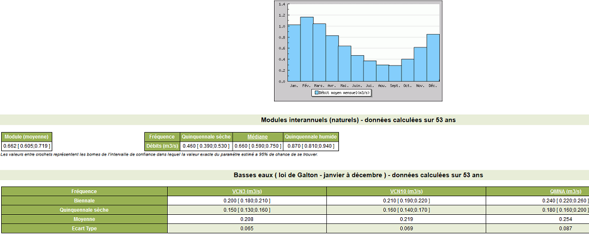
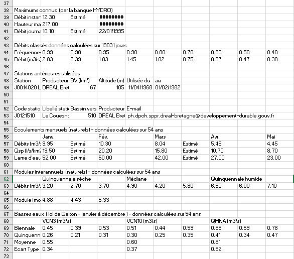
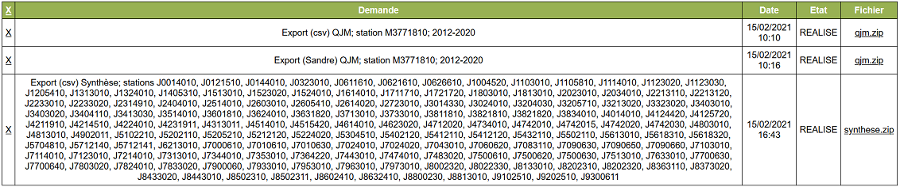
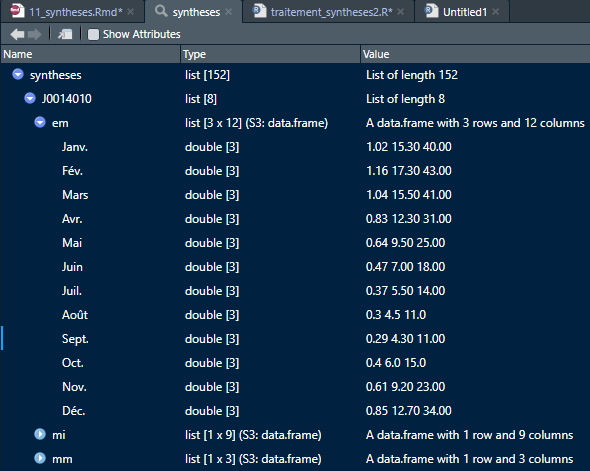

```{r setup, include = FALSE}
knitr::opts_chunk$set(
  collapse = TRUE,
  cache = FALSE,
  comment = "#>",
  fig.align = 'center'
)
```

## Eléments de contexte

Ce tuto est une des briques pour guider l'utilisateur dans l'usage du package [{hydrodataFR}](https://github.com/PascalIrz/hydrodataFR) dont les grandes lignes sont décrites dans un [article introductif](https://rpubs.com/kamoke/741350).


## Objectif du module

Ce tuto vise à présenter comment exploiter les données de synthèse qui sont téléchargeables depuis la banque HYDRO. Cette exploitation n'est pas évidente en l'absence d'API qui permettrait de collecter directement les informations dont on a besoin. De telles API existent pour les [mesures hydrométriques en temps réel](https://hubeau.eaufrance.fr/page/api-hydrometrie) ou la [piézométrie](https://hubeau.eaufrance.fr/page/api-piezometrie), mais pas (encore) pour les données de synthèses sur les stations hydrométriques.

Ces données sont donc proposées à l'affichage comme ça :



Ce qui est problématique c'est qu'une fois téléchargées, les données se présentent comme ça quand on les ouvre avec un tableur :



Ce qui n'est pas simple à utiliser. Par exemple, à l'échelle d'une région si l'on souhaite connaître les $QMNA_5$ de l'ensemble des stations.

**Ce tuto a pour ambition de rendre le moins fastidieuse possible l'exploitation de ces données téléchargées.**


## Chargement des packages

```{r, message = FALSE}
library(tidyverse)
library(hydrodataFR)
```

# Téléchargement des données de synthèse

>Le téléchargement nécessite un login et un mot de passe.

Les étapes sont les suivantes :

1. Avec le navigateur, aller sur le [site de la banque hydro](http://hydro.eaufrance.fr).
2. Se loguer.
3. Sélectionner ses stations (une par une, ou bien en masse comme ici toute une région).
4. Choisir un type d'export (ici appelé "Procédure").
5. Exporter au format CSV.
6. Collecter, décompresser et ranger dans un répertoire où on ira le chercher plus tard. La page pour récupérer l'export comprend un historique des téléchargements :



# Lecture des données

La fonction `bh_sy_parser()` permet de *parser*, c'est-à-dire d'interprêter, le contenu du fichier CSV.

Les préfixes des noms de cette famille de fonctions correspondent à `bh` pour "Banque HYDRO" et `sy_` pour "Synthèse".

```{r, eval = TRUE, warning = FALSE}
syntheses <- bh_sy_parser("../raw_data/5590_4_synthese.csv")
```

# Structure obtenue

L'objet retourné par la fonction `bh_sy_parser()` est une liste. Qui contient quoi ? Des listes. C'est une structure emboîtée qui peut sembler complexe mais qui est très pratique à l'utilisation, d'autant que tous ces objets sont nommés.

Pour connaître les noms (ici les 10 premiers) du premier niveau de la hiérarchie :

```{r}
names(syntheses)[1:10]
```

On a donc dans la liste autant d'objets qu'il y a de stations.

Ensuite, on si l'on s'intéresse à une des stations, voici le contenu :

```{r}
syntheses$J0121510
```

C'est un peu fouillis, en apparence du moins. En effet, on peut accéder par exemple aux écoulements mensuels de cette station. La fonction `kable()` du package `knitr` sert juste à la mise en forme.

```{r}
syntheses$J0121510$em %>%
  knitr::kable()
```

Pour rendre l'accès plus simple, la fonction `bh_sy_ind_sta()` prend des paramètres plus explicites :

```{r}
bh_sy_ind_sta(syntheses = syntheses,
              sta_id = "J0121510",
              indicateur = "mi") %>%
  knitr::kable() # pour une présentation moins brute
```

En fait, pour cette station, on dispose des éléments suivants :

```{r}
syntheses$J0121510 %>%
  names()
```
Ce qui s'interprète ainsi :

```{r, echo = FALSE}
data.table::fread("../raw_data/corresp_codes_indicateurs_sy.csv") %>% 
  knitr::kable()
```

En résumé, la liste des synthèses par station est une structure hiérarchisée :



# Exemples de représentations graphiques

```{r, fig.height = 5, fig.width = 5}
ma_station <- "J0626610"

bh_sy_ind_sta(syntheses = syntheses,
              sta_id = ma_station,
              indicateur = "em") %>% 
  t() %>% # transposition
  as.data.frame() %>% # la transposition avais fait perdre la classe dataframe
  rownames_to_column("Mois") %>% # les mois sont mis dans une colonne, puis
  mutate(Mois = fct_inorder(Mois)) %>% # on les fige dans l'ordre chronologique
  ggplot(aes(x = Mois,
             y = `Debits (m3/s)`)) +
      geom_bar(stat = "identity",
               fill = "#54b5c5") +
      labs(x = "", y = "Débit (m3/s)", title = ma_station)
```

Ou bien pour les fréquences cumulées des débits :

```{r, fig.height = 5, fig.width = 5}
donnees <- bh_sy_ind_sta(syntheses = syntheses,
              sta_id = ma_station,
              indicateur = "dc") %>% 
  t() %>% 
  as.data.frame() %>% 
  rownames_to_column("frequence") %>% 
  mutate(frequence = str_match(frequence, "[0-9.]+"),
         frequence = as.numeric(frequence)) %>% 
  filter(frequence < 0.95)  # suppression valeurs élevées qui tassent le graphe

debit_median <- donnees %>% 
  filter(frequence == 0.5) %>% 
  pull(`Debit (m3/s)`)

etiquette <- paste("Débit médian : ", debit_median, " m3/s")

ggplot(data = donnees, aes(x = `Debit (m3/s)`, y = frequence)) +
      geom_line(color = "#54b5c5", size = 1) +
      geom_vline(xintercept = debit_median, color = "red") +
      labs(x = bquote('Débit ('*m^3/h*')'),
           y = "Fréquence cumulée",
           title = ma_station) +
      geom_text(x = 1.2 * debit_median, y = 0.25,
                label = etiquette, angle = 90,
                color = "red") +
      scale_y_continuous(labels = scales::percent_format())
  
```

>Une fois les données chargées est structurées, l'utilisateur peut en faire ce qu'il veut. L'imagination au pouvoir, en quelque sorte !

```{r}
save(syntheses, file = "../processed_data/syntheses.RData")
```


